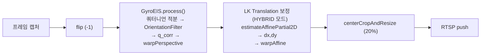
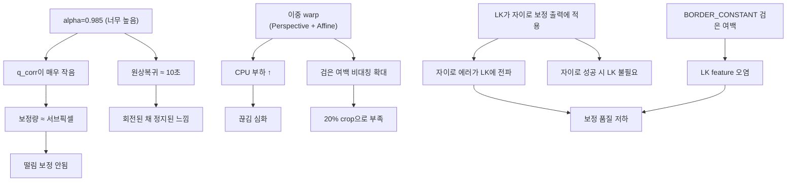

# 현재 EIS 코드 문제점 분석 (자이로 우선 + 3축 + LK)

> **대상 코드**: 리팩터링 후 구조 — [gyro_eis.cpp](file:///D:/VEDA/VEDA_Final_Project/src/gyro_eis.cpp) (쿼터니언 3축 자이로), [eis_capture.cpp](file:///D:/VEDA/VEDA_Final_Project/src/eis_capture.cpp) (하이브리드 파이프라인)

---

## 현재 코드 파이프라인 요약



### 핵심 구조

| 단계 | 파일 | 동작 |
|------|------|------|
| **1단계 (Gyro)** | `gyro_eis.cpp:302-365` | 쿼터니언 적분 → [OrientationFilter(slerp)](file:///D:/VEDA/VEDA_Final_Project/src/gyro_eis.cpp#251-252) → `q_corr = q_virtual * q_phys⁻¹` → `H = K·R·K⁻¹` → `warpPerspective` |
| **2단계 (LK)** | `eis_capture.cpp:488-529` | `gyro_out`에 대해 LK optical flow → translation(dx,dy)만 추출 → path smoothing → `warpAffine` |
| **Crop** | `eis_capture.cpp:616-618` | 고정 20% crop 후 resize |

---

## 🔴 문제 1: 끊김이 심한 이유

### 1-1. 이중 warp 연산

```
프레임마다:
  warpPerspective (3×3 homography, 640×480) → gyro_out   ← ~8-12ms
  warpAffine (2×3, 640×480) → stabilized                 ← ~3-5ms
  resize(crop → 원래 크기) → final                       ← ~3-5ms
  ────────────────────────────────────────────────────
  합계: ~14-22ms (이미 50ms 버짓의 28~44%)
```

- 이전 자이로 전용 코드는 `warpPerspective` 1회 + crop 1회였는데, 지금은 **`warpPerspective` + `warpAffine` + crop resize**로 **3단계 이미지 리샘플링**.
- RPi4에서 640×480 이미지를 매 프레임 3번 변환하는 것은 20fps 기준 상당한 부담.

### 1-2. LK 연산이 HYBRID에서 매 프레임 실행

```cpp
// eis_capture.cpp:493
bool do_lk = (trans.frame_count % std::max(1, LK_TRANS_EVERY_N) == 0);
```

- `LK_TRANS_EVERY_N = 2`이므로 매 2프레임마다 LK 실행이지만:
  - `cvtColor(gyro_out → GRAY)` 변환은 **매 프레임** 실행 (491줄)
  - `goodFeaturesToTrack` + `calcOpticalFlowPyrLK` + `estimateAffinePartial2D`는 약 **15-25ms**
  - 2프레임마다라도 50ms 중 절반 이상 소모

### 1-3. LK가 **자이로 보정된 출력에** 적용되는 문제

```cpp
// eis_capture.cpp:489
const Mat& trans_base = (mode == EisMode::HYBRID) ? gyro_out : frame;
// ...
// eis_capture.cpp:495
trans_ok = estimate_lk_transform(trans.prev_gray, curr_trans_gray, ...);
```

> [!CAUTION]
> `trans.prev_gray`는 이전 프레임의 `gyro_out`을 그레이로 변환한 것이다. 즉 **자이로 보정이 적용된** 이미지 간의 optical flow를 구하고 있다.
> - 자이로 보정이 잘 되면 → 프레임 간 모션이 거의 없어야 함 → LK가 추출하는 dx, dy는 이미 미미
> - 자이로 보정이 흔들리면 → 자이로 보정의 **에러가 LK에 전파**되어 LK도 부정확해짐
> - 즉 **자이로가 잘 될수록 LK는 불필요하고, 자이로가 안될수록 LK도 같이 망한다.**

---

## 🔴 문제 2: 보정이 안 되는 이유 (자이로랑 별 차이 없음)

### 2-1. OrientationFilter의 smooth_alpha가 너무 높음

```cpp
// eis_common.hpp:21
inline constexpr double SMOOTH_ALPHA = 0.985;
```

```cpp
// gyro_eis.cpp:257-266 (OrientationFilter::update)
double t = 1.0 - alpha_;   // t = 1 - 0.985 = 0.015
q_virtual_ = Quaternion::slerp(q_virtual_, q_phys, t);
```

- `alpha = 0.985` → slerp의 t = 0.015. 즉 **현재 물리 자세의 1.5%만 반영**.
- `q_virtual`이 `q_phys`를 매우 느리게 따라감 → `q_corr = q_virtual * q_phys⁻¹`이 **계속 누적됨**.
- 빠른 회전 후 원위치로 돌아와도 `q_virtual`이 아직 회전 중간 → **원상태 복귀가 매우 느림**.

> [!IMPORTANT]
> **alpha 0.985에서의 원상태 복귀**: 20fps에서 q_virtual이 q_phys의 95%까지 도달하는 데 약 **200프레임 ≈ 10초** 소요.
> 이것이 "원상태로 돌아오는 게 느리다"의 직접 원인.

### 2-2. Gain과 Clamp의 이중 축소

```cpp
// gyro_eis.cpp:336-338
e[0] = std::clamp(e[0] * cfg_.roll_gain, -cfg_.max_roll_rad, cfg_.max_roll_rad);
e[1] = std::clamp(e[1] * cfg_.pitch_gain, -cfg_.max_pitch_rad, cfg_.max_pitch_rad);
e[2] = std::clamp(e[2] * cfg_.yaw_gain, -cfg_.max_yaw_rad, cfg_.max_yaw_rad);
```

| 축 | gain | max (deg) | 효과 |
|----|------|-----------|------|
| Roll | 0.9 | 6° | 보정량을 10% 줄인 뒤 6°로 clamp |
| Pitch | 0.8 | 5° | 보정량을 20% 줄인 뒤 5°로 clamp |
| Yaw | 0.9 | 10° | 보정량을 10% 줄인 뒤 10°로 clamp |

- alpha가 높아서 `q_corr` 자체가 작은데, 거기에 gain까지 곱하면 **실제 보정각이 서브-도 수준**이 됨.
- "떨림이 여전하다" = 보정량이 떨림의 크기보다 작기 때문.

### 2-3. LK translation 보조가 실질적으로 미미

```cpp
// eis_common.hpp:34
inline constexpr double LK_TRANS_ALPHA = 0.90;
inline constexpr double LK_TRANS_MAX_CORR_PX = 30.0;
```

- `LK_TRANS_ALPHA = 0.90`은 path smoothing의 강도. 20fps에서 smooth_path가 actual_path의 95%에 도달하는 데 ~29프레임 ≈ 1.5초.
- `LK_TRANS_MAX_CORR_PX = 30px`이 클램프인데, 640px 폭에서 30px = 4.7%. 이것 자체는 합리적이나...
- **문제**: 자이로 보정된 이미지 간 optical flow이므로, translation 성분이 이미 매우 작고 노이즈가 많음.

---

## 🔴 문제 3: 검은 여백이 '회전되어 있는 느낌'인 이유

### 3-1. HomoGraphy의 회전 방향 문제

```cpp
// gyro_eis.cpp:332
Quaternion q_corr = q_virtual * q_phys.conjugate();
```

```
q_corr의 의미:
  q_phys  = 카메라가 실제로 회전한 자세 (적분)
  q_virtual = 우리가 보여주고 싶은 "smooth" 자세
  q_corr = q_virtual * q_phys⁻¹ = "현재에서 타겟으로의 회전"
```

**이 방향이 맞는지 확인**:
- `H = K * R(q_corr) * K⁻¹`
- `warpPerspective(frame, H, ...)` → 현재 프레임의 타 좌표를 매핑
- `warpPerspective`는 **역방향 매핑**이므로, 출력 픽셀의 위치에서 입력 픽셀 위치를 H로 찾음.
- 즉 H는 "출력 좌표 → 입력 좌표" 방향이어야 함.

> [!WARNING]
> `q_corr = q_virtual * q_phys⁻¹`은 **"물리 좌표계에서 가상 좌표계로의 변환"**이다.
> `warpPerspective`의 역방향 매핑과 결합하면:
> - 출력 좌표(안정화된 좌표)를 H로 변환 → 입력 좌표(물리 좌표) = 올바른 방향.
> - **방향 자체는 맞다.** 
>
> 그러나 **alpha가 너무 높아서 q_virtual이 q_phys를 매우 느리게 따라가므로, q_corr이 계속 한 방향으로 누적**된다.
> 카메라를 빠르게 움직이면 q_corr가 큰 각도까지 쌓이고, clamp(6°/5°/10°)에 걸리는 순간 **불연속적인 보정 경계**가 발생 → "회전된 채로 고정"되어 보이는 현상.

### 3-2. 이중 warp에 의한 여백 확대

```
1단계: warpPerspective(frame, H_gyro) → gyro_out
   → H_gyro의 회전각만큼 검은 여백 발생 (BORDER_CONSTANT)

2단계: warpAffine(gyro_out, Ht_translation) → stabilized  
   → translation 보정으로 추가 이동 → 이미 있던 검은 여백이 더 넓어지거나 비대칭으로 변함

3단계: centerCropAndResize(20%) → 고정 crop
   → 20% crop이 비대칭 여백을 못 커버하면 검은 부분이 그대로 노출
```

**자이로만 사용할 때**: warpPerspective 1회 → crop → 여백이 대칭적이고 예측 가능.
**현재 (자이로+LK)**: warpPerspective → warpAffine → crop → **여백이 비대칭**이고, LK의 translation이 틀리면 여백이 이상한 위치에 발생.

### 3-3. warpPerspective의 BORDER_CONSTANT

```cpp
// gyro_eis.cpp:343
cv::warpPerspective(frame, out, H, frame.size(), cv::INTER_LINEAR, cv::BORDER_CONSTANT);
```

- `BORDER_CONSTANT`는 영역 밖을 **검은색(0)**으로 채움.
- GyroEIS 내부의 crop이 **비활성화**되어 있음:

```cpp
// eis_capture.cpp:271
cfg.enable_crop = false; // crop after all warps
```

- 즉 자이로 warp 후 검은 여백이 그대로 남아서 LK 단계로 넘어감.
- LK는 이 검은 여백이 포함된 이미지에서 feature를 추출 → **검은 영역의 코너가 feature로 잡힐 수 있음** → translation 추정 왜곡.

---

## 🔴 문제 4: 떨림이 여전한 이유

### 요약: 보정 체인의 효과가 극히 미미

```
실제 카메라 떨림: ±2° (roll), ±1.5° (pitch), ±3° (yaw) @핸드헬드 가정

OrientationFilter 후 q_corr 크기:
  alpha=0.985, 20fps → q_corr ≈ 떨림의 1.5% = ±0.03° (roll)

Gain 적용 후:
  ±0.03° × 0.9 = ±0.027° (roll)

이 각도의 화면 보정:
  640px 폭에서 0.027° ≈ 0.3 pixel 이동
  → 사실상 보정 효과 없음
```

> [!IMPORTANT]
> **현재 파라미터 조합에서 자이로 보정은 사실상 아무것도 안 하는 것과 같다.**
> 자이로만 사용했을 때와 차이가 없는 이유가 바로 이것이다.

---

## 전체 문제 구조도



---

## 핵심 문제 정리

| # | 증상 | 근본 원인 | 위치 |
|---|------|-----------|------|
| 1 | 끊김이 심함 | 이중 warp (Perspective + Affine + crop resize) = 매 프레임 3회 이미지 리샘플링 | `gyro_eis.cpp:343` + `eis_capture.cpp:523` + `eis_capture.cpp:617` |
| 2 | 보정이 안됨 | `alpha=0.985`로 보정량이 서브픽셀 수준 | `eis_common.hpp:21` |
| 3 | 검은 여백 회전 느낌 | alpha 높아 q_corr 편향 누적 + BORDER_CONSTANT + 내부 crop 비활성 | `gyro_eis.cpp:332` + `eis_capture.cpp:271` |
| 4 | 원상복귀 느림 | alpha=0.985, 20fps → 95% 복귀에 ~10초 | `gyro_eis.cpp:263-264` |
| 5 | LK 추가가 역효과 | 자이로 보정된 이미지에서 LK 실행 → 자이로 에러 전파 + 검은 여백 feature 오염 | `eis_capture.cpp:489-496` |
